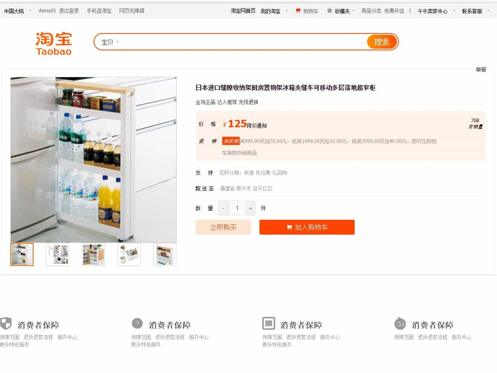
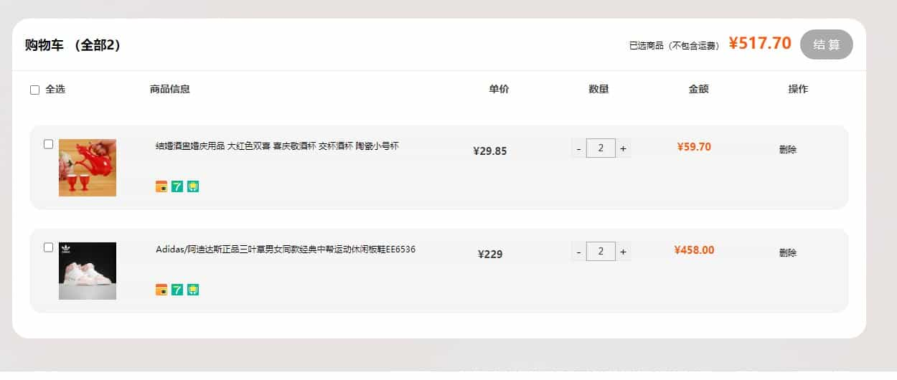

# shop


## 介绍

该项目为前端 vue 实训简易仿淘宝 pc 端，包含四个页面，首页、登录页面、商品详情页、购物车页面

使用Netlify部署 [在线预览](https://tb.yhyl.fun/#/home)

## 主要技术栈

- Vue2 框架

- vue-router 路由跳转

- vuex 组件间通信

- scss 预处理器

- swiper 轮播图

- axios 发送请求

- vue-lazyload 图片懒加载

- vue-jsonp 解决跨域请求

## 项目已有功能

1. 首页数据展示，商品信息在/public/server/ProdInfo.json 文件中

2. 搜索框关键词联想，支持上下按键及点击跳转到官网页面（要事先登录过淘宝官网，否则会跳转到官网登录页面）

3. 本地登录、注册功能

4. 商品详情页，可添加入购物车。

5. 购物车页面增加、删除商品，每个用户购物车分离

```
已有内置账号：
用户：demo01   密码：123456
用户：demo02   密码：123456
```

**该项目无后台，所有注册账号和购物车数据均存储在 localstroage!**

## 使用

```
git clone --depth=1 https://github.com/tk914/shop.git
cd shop
yarn install
yarn serve
```

## 项目效果展示

- 首页（未登录）
  
  （已登录）
  

- 登录界面

  

- 商品详情页
  

- 购物车页面
  
